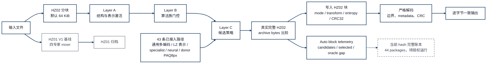

# HybridZip R2: Current Architecture

This companion reflects the current source-level R2 portfolio: all 43 decoder-visible HZ02 modes, the three-layer Auto router, complete archive-byte comparison, and strict per-block decode checks are integrated. The only dashed item is the current-hash full runtime ledger and its measured retention decision.

The fixed-position 16:9 figure is `hybridzip-current-architecture.svg` and its PNG export.

