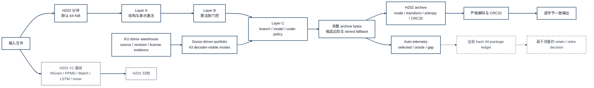

# HybridZip R2: Full Operational Architecture

This target diagram now distinguishes integrated product capability from the remaining evidence gate. The donor warehouse, 43-mode portfolio, representation/LZ/specialist/neural branches, three router layers, multi-coder comparison, HZ02 contract, and HZ01 compatibility path are source-integrated. The dashed steps are the current-hash ledger run and the resulting measured retain/retire decision.

The fixed-position 16:9 figure is `hybridzip-full-r2-architecture.svg` and its PNG export.

