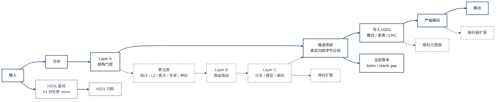

# HybridZip R2: Full Target Architecture

The fixed-position 16:9 PPT figure is `hybridzip-full-r2-architecture.svg` and its PNG export. This Mermaid source remains a compact logical companion.

```mermaid
%% Logical Mermaid companion. Use hybridzip-full-r2-architecture.svg/.png for the fixed 16:9 PPT figure.
%% Solid = implemented foundation. Dashed = planned extension.
flowchart LR
    input[输入] --> blocks[分块] --> layerA[Layer A<br/>结构门控] --> candidates[候选系统<br/>真实归档字节比较] --> archive[写入 HZ02<br/>模式 / 变换 / CRC] --> decoder[严格解码] --> output[输出]
    input --> hz01[HZ01 基线<br/>V1 四专家 mixer] --> hz01out[HZ01 归档]
    layerA -.-> families[算法族<br/>统计 / LZ / 表示 / 专家 / 神经] -.-> layerB[Layer B<br/>族级路由] -.-> layerC[Layer C<br/>分支 / 模型 / 编码] -.-> candidates
    candidates --> ledger[当前账本<br/>bytes / oracle gap]
    layerC -.-> neural[神经扩展]
    archive -.-> metadata[解码元数据]
    decoder -.-> extension[解码器扩展]

    classDef current fill:#FFFFFF,stroke:#163A5F,stroke-width:2px,color:#111827;
    classDef baseline fill:#FFFFFF,stroke:#6B7280,stroke-width:1.5px,color:#374151;
    classDef planned fill:#FFFFFF,stroke:#6B7280,stroke-width:1.5px,stroke-dasharray:6 4,color:#374151;
    class input,blocks,layerA,candidates,archive,decoder,output,ledger current;
    class hz01,hz01out baseline;
    class families,layerB,layerC,neural,metadata,extension planned;
    linkStyle default stroke:#163A5F,stroke-width:2px;
```
